# Natural Product Database - ER 图（完整版）

## 数据库实体关系图

```mermaid
erDiagram
    %% ============================================
    %% natural_products 天然产物表 (28个字段)
    %% ============================================
    natural_products {
        bigint id PK "主键ID"
        varchar_50 np_id UK "天然产物编号"
        varchar_100 inchikey UK "InChIKey"
        text pref_name "首选名称"
        text iupac_name "IUPAC命名"
        varchar_10 name_initial "名称首字母"
        text inchi "InChI"
        text smiles "SMILES"
        varchar_50 chembl_id "ChEMBL编号"
        varchar_50 pubchem_id "PubChem CID"
        numeric molecular_weight "分子量g/mol"
        numeric xlogp "脂水分配系数"
        numeric psa "极性表面积"
        varchar_200 formula "分子式"
        integer h_bond_donors "氢键供体数"
        integer h_bond_acceptors "氢键受体数"
        integer rotatable_bonds "可旋转键数"
        integer num_of_organism "关联生物来源数"
        integer num_of_target "关联靶点数"
        integer num_of_activity "活性记录数"
        timestamp created_at "创建时间"
        timestamp updated_at "更新时间"
        boolean if_quantity "是否有定量数据"
        numeric log_s "LogS水溶解度"
        numeric log_d "LogD分布系数"
        numeric log_p "LogP分配系数"
        numeric tpsa "拓扑极性表面积"
        integer ring_count "环数目"
    }

    %% ============================================
    %% targets 靶点表 (20个字段)
    %% ============================================
    targets {
        bigint id PK "主键ID"
        varchar_50 target_id UK "靶点编号"
        varchar_200 target_type "靶点类型"
        varchar_500 target_name "靶点名称"
        varchar_200 target_organism "来源物种"
        varchar_100 target_organism_tax_id "物种分类ID"
        varchar_300 uniprot_id "UniProt编号"
        integer num_of_compounds "关联化合物数"
        integer num_of_activities "活性记录数"
        timestamp created_at "创建时间"
        timestamp updated_at "更新时间"
        integer num_of_natural_products "关联天然产物数"
        varchar_100 gene_name "基因名称"
        text synonyms "同义词"
        text function "功能描述"
        varchar_500 pdb_structure "PDB结构编号"
        varchar_200 bioclass "生物分类"
        varchar_50 ec_number "EC编号"
        text sequence "蛋白质序列"
        varchar_50 ttd_id "TTD编号"
    }

    %% ============================================
    %% bio_resources 生物资源表 (21个字段)
    %% ============================================
    bio_resources {
        bigint id PK "主键ID"
        varchar_50 resource_id UK "资源唯一编号"
        varchar_50 resource_type "资源类型"
        varchar_500 chinese_name "中文名称"
        varchar_500 latin_name "拉丁学名"
        varchar_100 taxonomy_kingdom "分类学-界"
        varchar_200 taxonomy_family "分类学-科"
        varchar_200 taxonomy_genus "分类学-属"
        varchar_200 taxonomy_species "分类学-种"
        varchar_50 taxonomy_id "NCBI分类ID"
        varchar_500 tcmid_id "TCMID编号"
        integer num_of_natural_products "天然产物数"
        integer num_of_prescriptions "处方数"
        timestamp created_at "创建时间"
        timestamp updated_at "更新时间"
        varchar_50 species_tax_id "种级分类ID"
        varchar_50 genus_tax_id "属级分类ID"
        varchar_50 family_tax_id "科级分类ID"
        varchar_50 cmaup_id "CMAUP编号"
        varchar_255 official_chinese_name "官方中文名"
        varchar_500 standard_chinese_name "标准中文名"
    }

    %% ============================================
    %% bioactivity 生物活性表 (18个字段)
    %% ============================================
    bioactivity {
        bigint id PK "主键ID"
        bigint natural_product_id FK "天然产物ID"
        bigint target_id FK "靶点ID"
        varchar_100 activity_type "活性类型"
        varchar_100 activity_type_grouped "活性类型分组"
        varchar_10 activity_relation "关系符号"
        numeric activity_value "原始活性值"
        varchar_100 activity_units "原始单位"
        numeric activity_value_std "标准化值nM"
        varchar_20 activity_units_std "标准化单位"
        varchar_200 assay_organism "实验物种"
        varchar_100 assay_tax_id "物种分类ID"
        varchar_100 assay_strain "实验菌株"
        varchar_200 assay_tissue "实验组织"
        varchar_100 assay_cell_type "细胞类型"
        varchar_300 ref_id "文献ID"
        varchar_20 ref_id_type "文献类型"
        timestamp created_at "创建时间"
    }

    %% ============================================
    %% bio_resource_natural_products 生物资源-天然产物关联表 (16个字段)
    %% ============================================
    bio_resource_natural_products {
        bigint id PK "主键ID"
        text org_id "生物来源编号"
        text np_id "天然产物编号"
        text src_org_record_id "来源生物记录ID"
        text src_org_pair_id "配对ID"
        text src_org_pair "配对信息"
        text new_cp_found "是否发现新化合物"
        text org_isolation_part "分离部位"
        text org_collect_location "采集地点"
        text org_collect_time "采集时间"
        text ref_type "文献类型"
        text ref_id "文献ID"
        text ref_id_type "文献ID类型"
        text ref_url "文献URL"
        timestamp created_at "创建时间"
        timestamp updated_at "更新时间"
    }

    %% ============================================
    %% bio_resource_disease_associations 生物资源-疾病关联表 (11个字段)
    %% ============================================
    bio_resource_disease_associations {
        bigint id PK "主键ID"
        bigint bio_resource_id FK "生物资源ID"
        bigint disease_id FK "疾病ID"
        text evidence_therapeutic_target "治疗靶点证据"
        boolean evidence_transcriptome "转录组证据"
        text evidence_clinical_trial_plant "植物临床试验证据"
        text evidence_clinical_trial_ingredient "成分临床试验证据"
        numeric_3_2 confidence_score "置信度评分"
        varchar_100 source "数据来源"
        varchar_50 source_version "数据版本"
        timestamp created_at "创建时间"
    }

    %% ============================================
    %% diseases 疾病表 (8个字段)
    %% ============================================
    diseases {
        bigint id PK "主键ID"
        varchar_50 icd11_code "ICD-11编码"
        varchar_500 disease_name "疾病英文名"
        varchar_500 disease_name_zh "疾病中文名"
        varchar_200 disease_category "疾病分类"
        timestamp created_at "创建时间"
        timestamp updated_at "更新时间"
        varchar_500 disease_name_cmaup "CMAUP疾病名"
    }

    %% ============================================
    %% prescriptions 处方表 (12个字段)
    %% ============================================
    prescriptions {
        bigint id PK "主键ID"
        varchar_50 prescription_id UK "处方编号"
        varchar_500 chinese_name "处方中文名"
        varchar_200 pinyin_name "拼音名"
        varchar_500 english_name "英文名"
        text functions "功能功效"
        text indications "主治"
        varchar_50 tcmid_id "TCMID编号"
        timestamp created_at "创建时间"
        timestamp updated_at "更新时间"
        text disease_icd11_category "ICD-11分类"
        text reference "参考文献"
    }

    %% ============================================
    %% prescription_resources 处方-生物资源关联表 (5个字段)
    %% ============================================
    prescription_resources {
        bigint id PK "主键ID"
        bigint prescription_id FK "处方ID"
        bigint bio_resource_id FK "生物资源ID"
        timestamp created_at "创建时间"
        varchar_500 tcmid_component_id "TCMID组分ID"
    }

    %% ============================================
    %% sys_dict 系统字典表 (14个字段)
    %% ============================================
    sys_dict {
        bigint dict_code PK "字典编码"
        integer dict_sort "排序号"
        varchar_100 dict_label "字典标签"
        varchar_100 dict_value "字典键值"
        varchar_100 dict_type "字典类型"
        varchar_100 css_class "CSS样式类"
        varchar_100 list_class "列表样式类"
        char_1 is_default "是否默认"
        char_1 status "状态"
        varchar_64 create_by "创建者"
        timestamp create_time "创建时间"
        varchar_64 update_by "更新者"
        timestamp update_time "更新时间"
        varchar_500 remark "备注"
    }

    %% ============================================
    %% sys_menu 系统菜单表 (19个字段)
    %% ============================================
    sys_menu {
        bigint menu_id PK "菜单ID"
        varchar_50 menu_name "菜单名称"
        bigint parent_id "父菜单ID"
        integer order_num "显示顺序"
        varchar_200 path "路由地址"
        varchar_255 component "组件路径"
        varchar_255 query_param "路由参数"
        integer is_frame "是否外链"
        integer is_cache "是否缓存"
        char_1 menu_type "菜单类型"
        char_1 visible "显示状态"
        char_1 status "状态"
        varchar_100 perms "权限标识"
        varchar_100 icon "菜单图标"
        varchar_64 create_by "创建者"
        timestamp create_time "创建时间"
        varchar_64 update_by "更新者"
        timestamp update_time "更新时间"
        varchar_500 remark "备注"
    }

    %% ============================================
    %% 实体关系
    %% ============================================
    natural_products ||--o{ bioactivity : "has"
    targets ||--o{ bioactivity : "targeted_by"
    natural_products ||--o{ bio_resource_natural_products : "found_in"
    bio_resources ||--o{ bio_resource_natural_products : "contains"
    bio_resources ||--o{ bio_resource_disease_associations : "treats"
    diseases ||--o{ bio_resource_disease_associations : "treated_by"
    prescriptions ||--o{ prescription_resources : "composed_of"
    bio_resources ||--o{ prescription_resources : "used_in"
```



## 表字段统计

| 表名 | 中文名 | 字段数 | 记录数 |
|------|--------|--------|--------|
| natural_products | 天然产物表 | 28 | ~203,000 |
| targets | 靶点表 | 20 | ~8,700 |
| bio_resources | 生物资源表 | 21 | ~49,000 |
| bioactivity | 生物活性表 | 18 | ~1,050,000 |
| bio_resource_natural_products | 生物资源-天然产物关联表 | 16 | ~1,117,000 |
| bio_resource_disease_associations | 生物资源-疾病关联表 | 11 | ~802,000 |
| diseases | 疾病表 | 8 | ~1,500 |
| prescriptions | 处方表 | 12 | ~7,400 |
| prescription_resources | 处方-生物资源关联表 | 5 | ~80,000 |
| sys_dict | 系统字典表 | 14 | - |
| sys_menu | 系统菜单表 | 19 | - |
| **合计** | | **172** | **~3,270,000** |

## 实体关系说明

```
natural_products (天然产物)          targets (靶点)
        │                                │
        └────────────┬───────────────────┘
                     │
                     ▼
              bioactivity (生物活性)
                     │
                     │
        ┌────────────┴────────────┐
        │                         │
        ▼                         ▼
bio_resource_natural_    bio_resource_disease_
products (资源-产物)      associations (资源-疾病)
        │                         │
        │                         │
        ▼                         ▼
bio_resources (生物资源) ◄──── diseases (疾病)
        │
        │
        ▼
prescription_resources (处方-资源)
        │
        │
        ▼
prescriptions (处方)
```

## 数据来源

| 数据源 | 说明 | 相关表 |
|--------|------|--------|
| NPASS 3.0 | 天然产物及活性数据库 | natural_products, targets, bioactivity, bio_resource_natural_products |
| TCMID | 中药分子数据库 | prescriptions, bio_resources, prescription_resources |
| CMAUP | 中药材数据库 | bio_resources, diseases, bio_resource_disease_associations |
| TTD | 治疗靶点数据库 | targets |

---
*生成时间: 2026-02-22*
*数据库: npdb (PostgreSQL 16)*
